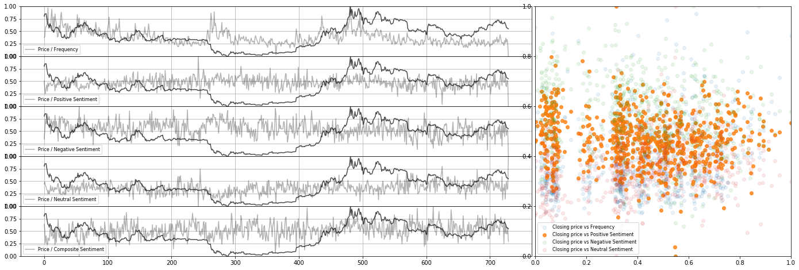

## Multivariate time-series forecasting with LSTM

After scraping all mentions of "bitcoin" on reddit within the past year, I synchronized the daily keyword frequency/sentiment values with the \$BTC-USD closing price from that day

A memory-based deep learning model was then trained on this data to make predictions about the stock's behavior.

Shown below is the model's predicted $BTC-USD activity for December of 2019 through February 2020

  

Here is the models performance when given a larger sequence to predict (04/2019 through 02/2020)

 

Perhaps the larger scale is decieving, but visually it appears to capture the general trend quite well