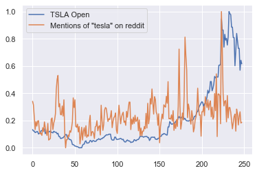
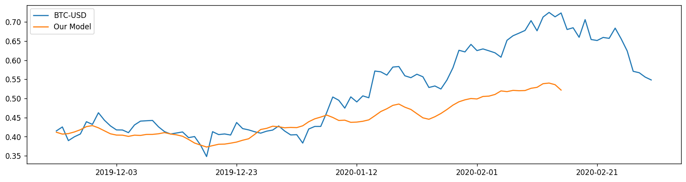
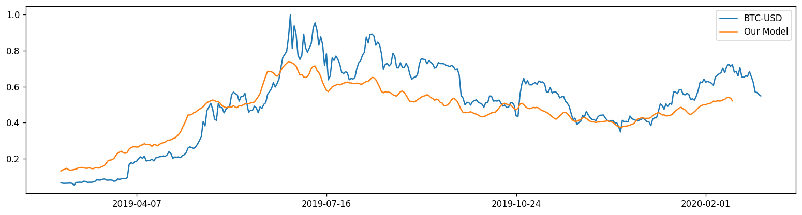

## Multivariate time-series forecasting with LSTM

After scraping all mentions of "bitcoin" on reddit within the past year, I synchronized the daily keyword frequency/sentiment values with the \$BTC-USD closing price from that day

A memory-based deep learning model was then trained on this data to make predictions about the stock's behavior.

  
  